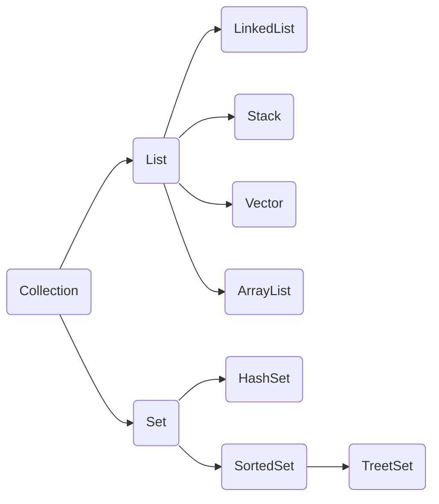
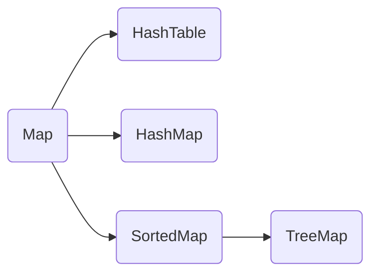

# 컬렉션 

> 자바에서 자료 구조를 구현한 클래스이다.
> 
> 자료 구조란 자료를 저장하기 위한 구조이다.
> 
> 대부분의 프로그램은 자료를 저장하기 떄문에 필요에 따라서 적절한 자료 구조를 사용할 지를 결정한다.
> 
> > 예) 전화번호 저장 , 시간표저장
<br>
<br>
<br>


### 컬렉션의 종류 

> 자바는 컬렉션 인터페이스와 컬렉션 클래스로 나누어서 제공한다.
> 
> 컬렉션 라이브러리들은 모두 제니릭 기능을 지원한다.

|인터페이스 | 설명 |
|:---:|:------:|
|Collection|모든 자료 구조의 부모 인터페이스로 객체의 모임|
|Set | 집합(중복된 원소를 가지지 않는)을 나태는 자료 구조 |
|List | 순서가 있는 자료 구조로 중복된 원소를 가질 수 있다.|
|Map | 키와 값으로 구성 |
|Queue | 들어오는 순서대로 나가는 자료구조 |


<br>
<br>


<br>
<br>
<br>

### Set

코드 

```java
  import java.util.*;

public class SetTest {

    public static void main(String[] args) {

        HashSet<String> hashset=new HashSet<>();  // 내가 아무렇게 데이터를 넣었지만 시스템 내부에서 알아서 정렬되서 나온다.
        LinkedHashSet<String> linkedhashset=new LinkedHashSet<>();  // 내가 넣은 그대로 나온다.
        TreeSet<String> treeset=new TreeSet<>();

        hashset.add("4");
        hashset.add("2");
        hashset.add("3");
        hashset.add("1");
        hashset.add("4");

        linkedhashset.add("4");
        linkedhashset.add("2");
        linkedhashset.add("3");
        linkedhashset.add("1");
        linkedhashset.add("4");

        treeset.add("4");
        treeset.add("2");
        treeset.add("4");
        treeset.add("3");
        treeset.add("1");
        treeset.add("4");


        Iterator<String> iterator= hashset.iterator();
        while(iterator.hasNext()){
            System.out.println(iterator.next());
        }

        System.out.println("====================================");
        Iterator<String> iterator2= linkedhashset.iterator();
        while(iterator2.hasNext()){
            System.out.println(iterator2.next());
        }
        System.out.println("====================================");
        Iterator<String> iterator3= treeset.iterator();
        while(iterator3.hasNext()){
            System.out.println(iterator3.next());
        }
    } 
 }
```
위에 코드를 보게 되면 일단 HashSet, LinkedHashSet, TreeSet 모두 들어가는 값이 (키값)이 중복되는것을 걸러주고

 HashSet은  자료가 추가된 순서와 상관없이 출력되는것을 알수 있고 

LinkedHashSet은 내가 넣은 값 순서대로 출력되고 

TreeSet은 내가 넣은 값을 정렬해서 나오는것을 알수 있다.

<br>
<br>
<br>


### Map

코드


### Vector 클래스  

> 백터 클래스는 java에서 가장 오랜된 자료구조 구현 클래스이다.
> 
> 배열의 경우, 크기가 고정되어 있기 때문에 사용이 불편하다.
> 
>  백터는 가변 크기의 배열을 구현한다.
>  
>  요소의 개수가 늘어나면 자동으로 배열의 크기가 늘어난다.


VectorTest.java

```java 
  public class VectorTest {

    public static void main(String[] args) {
        Vector vector=new Vector();

        vector.add("홍길동");
        vector.add("남자");
        vector.add(25);
        vector.add(80.15);
        String name=(String)vector.get(0);
        int age=(int)vector.get(2);

        for (Object x:vector) {
            System.out.println(x);
         }
     }
 }
```


벡터의 리턴 값은 Object 이다.

그러기 떄문에 만약에 각각의 변수나 String에 넣고 싶을 떄는 형번환을 해준다음 

변수에 넣어야 한다.

