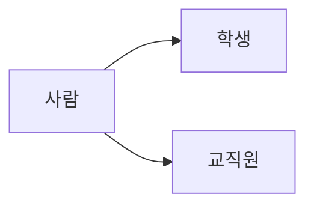

# 객체지향 언어 특징 및 정리 

  객체지향 언어 특징 4가지 
 
 1. 추상화 
 2. 캡슐화 
 3. 상속
 4. 다형성 
 
 > 1. 추상화 
 > 
 > > 실세계의 객체에서 불필요한 부분을 제거하여 필요한 부분만을 간결하고 이해하기 쉬운 클래스로 만드는 작업이다.
 > >
 
 ```mermaid
graph LR
B{계좌}
    B -->K[추상화]
    K --> C[데이터]
    K -->  H[기능]
    C --> D[계좌번호]
    C --> E[비밀번호]
    C --> F[이름]
    C --> G[잔액]
    H --> I[입금]
    H --> J[출금]
 ```
클래스화(코드화)
 
 

<span style="color: red"> 객체화를 할때는 모든것을 객체화하는것이 아니라 필요한것만 추상화를 한다. </span>

> 2. 캡슐화
> 
> > 객체와 객체 간의 의사 소통을 위한 정보만을 노출한다. - 실제 내부 구현 정보는 숨기는 원리 
> >
> > 추상화 과정에서 클래스를 정의할때 - 객체의 자료와 행위를 클래스 단위로 하나로 묶고, 실제 내부 구현 내용을 외부에 감추는 것이다.
> >
> > 즉, 쉽게 설명을 하면 음료수 자판기에서 나는 돈을 넣고, 제품을 선택을 하면 자판기에서는 어떠한 내부시스템으로 돌아가는지는 몰라도 원하는 음료수만 나오면 되는것이라고 해석할수 있다.
> > 
> > 제품 선택 -> 함수(메소드) / 돈을 넣고 -> 함수호출시 전달 파라미터 / 음료수를 준다 -> 리턴값 


> 3. 상속 
> 
> > 상속은 쉽게 말하면 '물려받는다' 라는 특징을 가지고 있다.
> >
> > 장점 - 공통의 특성을 하위 클래스마다 반복적으로 기술하지 않고 한 번만 기술하기 때문에 중복을 줄여 재사용성의 효과를 준다.

상속을 사용하는 프로그래밍 
   ( 사람 -> (공통코드) )


> 4. 다형성 
> 
> > 외부에서 보이는 모습은 한 가지 형태지만 실직적으로 쓰이는 기능은 여러 가지 역할을 수행한다는 의미이다.
> >
> > 다형성의 예  - 오버로딩 / 오버 라이딩
> >
> > 예)
 
이동한다 라는 의미는 같지만 대상에 따라 달라진다.

{사람} -> 걸어서 이동한다.    /  {비행기} -> 날아서 이동한다.   / {탱크} -> 바퀴로 이동한다.

