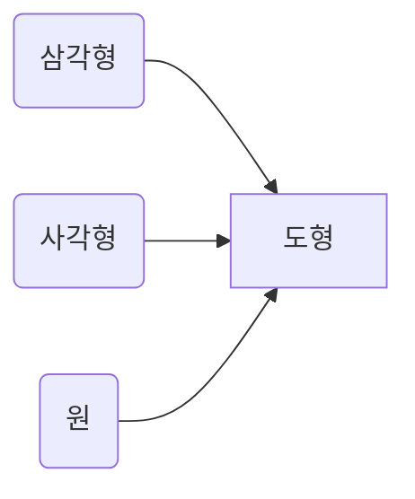

# 추상 클래스  (abstract)

> 클래스 계층구조에서 상위에 위치하며, 하위 클래스를 대표핱는 클래스이다.
> 
> 보통 우리가 추상이라는 의미는 "구체적이지 않고 추출하여 파악한다" 는 뜻을 가지고 있는데 
> 
> 추상 클래스 또한 구체적이지 않은 클래스라고 생각하면된다. 

<br>
<br>

> 다른 일반 클래스와 구별되는 특징 
> 
> > 추상 클래스는 직접 객체화 될수가 없다. (즉, 생성자를 이용해서 객체를 생성할수 없다는 소리이다.)
> > 
> > 추상 클래스는 다른 클래스에 의하여 상속되어야한다.(즉, 하위 클래스가 없는 추상 클래스는 의미가 없다.)
> > 
> > 추상 클래스는 하위 클래스가 있어야 하므로 구현 시 클래스 앞에 키워드 final이 올수가 없다.





예제 )

Shapes.java 

```java 
  public abstract class Shapes {

    protected double x;
    protected double y;

    public Shapes(double x,double y){
        this.x=x;
        this.y=y;
    }
    public abstract void draw();
  }
```

Rectangle.java 

```java
 public class Rectangle extends Shapes{

    public Rectangle(int x,int y){
        super(x,y);
    }
    @Override
    public void draw() {
        System.out.println("사각형의 x값: "+x+", y값: "+y);
    }
 }
```

Circle.java

```java
 public class Circle extends Shapes{

    public Circle(int x,int y){
        super(x,y);
    }
    @Override
    public void draw() {
        System.out.println("원의 x값: "+x+", y값: "+y);
    }
 }
```

Triangle.java

```java 
  public class Triangle extends Shapes{

    public Triangle(int x,int y){
        super(x,y);
    }
    @Override
    public void draw() {
        System.out.println("삼각형의 x값: "+x+", y값: "+y);
    }
 }
```

ShapesTest.java  

```java 
  public class ShapesTest {

    public static void main(String[] args) {
        Rectangle rectangle=new Rectangle(10,20);
        rectangle.draw();
         Circle circle=new Circle(20,30);
        circle.draw();
         Triangle triangle=new Triangle(40,50);
        triangle.draw();
    }
 }
```

결과 
```
사각형의 x값: 10, y값: 20
원의 x값: 20, y값: 30
삼각형의 x값: 40, y값: 50
```


