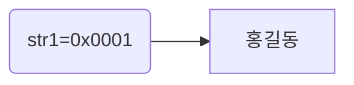

# String Buffer 와 String Builder 

<br>
<br>

### String Buffer 와 String Builder

> 문자열 처리는 보통 String 이 하지만 불편의 속성을 갖게 된다. 

예시 )

String str1="홍길동"
 


만약에 홍길동 문자열을 저장하게 되면 

str1 이라는 변수가 "홍길동"의 문자열이 저장되어 있는 

주소 값을 str1 이 가지고 있게 된다.

근데 str1에 문자열을 더하게 된다면 어떻게 될까?

st1= str1+"학생";

이라고 선언을 하게되면 지금 str1이 가지고 있는 주소값 0x0001에

홍길동 학생이라고 붙어 있으면 좋곘지만 그렇지 않다는 것이다.

홍길동 의 문자열과 학생의 문자열이 합쳐친 또다른 공간을 만들고 

그 공간의 주소(할당된 주소)를 str1이 가지게 된다.

즉 , 결론은 문자열을 계속 더해주면 기존의 주소값에서 데이터의 값이 추가가 되는 것이 아니라 

새로운 공간을 계속 만들고 그 할당된 주소 값을 변수가 가지게 되는 것이다.

그러다 보니 문자열의 변경이 빈번하게 자주 일어나게 될 경우에는 메모리의 영향이 클 수 밖에 없다. 

이 문제를 해결하기  위해서 불변이 아닌 가변의 속성인 

### String Buffer 클래스 또는 String Builder

를 사용한다.


코드 예시 

```java 
   public class StringBufferTest {

	public static void main(String[] args) {
		// TODO Auto-generated method stub

		StringBuffer sb=new StringBuffer();  // StringBuffer
		
		sb.append("홍길동");
		sb.append(System.lineSeparator());  // 한줄 띄어쓰기
		sb.append("학생");
    
		/*   이렇게 선언 해도 상관 없음 
		sb.append("홍길동")
		  .append(System.lineSeparator()) // 한줄 띄어쓰기
		  .append("학생");
		*/            
    
    StringBuilder sb1=new StringBuilder(); // StringBuilder
    
		sb1.append("홍길동");
		sb1.append(System.lineSeparator());
		sb1.append("학생"); 
		System.out.println(sb1.toString());
	}
 }
```

그러면 String Buffer 와 String Builder는 언제 써야되나?

 간단하게 정리를 해보면 

String -> 문자열 연산이 적고 멀티쓰레드 환경일 경우 

StringBuffer -> 문자열 연산이 많고 멀티쓰레드 환경일 경우 (멀티 쓰레드는 CPU의 최대 활용을 위해서 프로그램을 둘 이상 동시에 실행하는 것)

StringBuilder  -> 문자열 연산일 많고 싱글쓰레드 또는 동기화를 고려하지 않아도 되는 경우 (싱글 쓰레드는 오직 하나의 쓰레드로만 실행하는 것)

쓰면 된다.
