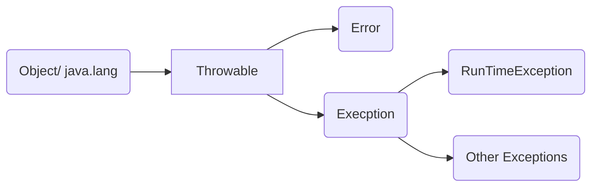

# 예외처리 

> 프로그램 오류 - 프로그램 실행 중 오작동을 하거나 비정상적으로 종류되는 경우이다.
> 
> 발생시점에 따라 컴파일 에러, 런타임 에러로 나뉜다.

컴파일 에러 - 컴파일 시에 발생하는 에러 이다.

런타임 에러 - 실행시 발생하는 에러 이다.
  
논리적 에러 - 실해은 되지만, 의도와 다르게 동작하는것이다.

> 기본적으로 프로그램에서 오류가 발생한다면 프로그램은 대부분 비정상적으로 종류가 된다.
> 
> 하지만, 이런 오류중에서 프로그램으로 나름 대응할 수 있는 오류가 있는데 이런 대응 가능한 부분을 예외라고 한다.


예외처리 클래스 



Other Exceptions 은 보통 일반적인 에러이다.( 예외에 대한 부분을 명시적으로 처리해줘야 된다.)

파일에러, 클래스 에러, 데이터베이스 에러 등등이 있다.

RunTimeException 은 실행시 발생하는 에러이다. 

배열의 공간 에러, 계산에러 등등이 있다.

<br>
<br>
<br>

### 예외처리 방법

1. 내가 try catch 한다 
2. throw 한다. 넘긴다.


예시 

``` java 
  public class ExTest {
    public static  void method1(int x, int y) {

        System.out.println(x/y);
    }
    public static void main(String[] args) {

        method1(1,0);
    }
 }
```

결과
```
Exception in thread "main" java.lang.ArithmeticException: / by zero
	at ExTest.method1(ExTest.java:5)
	at ExTest.main(ExTest.java:9)
```

위의 코드를 실행시키면 에러가 발생한다. 

그 이유는 0으로 나누기 때문이다.

이럴 때 예외처리를 하는데 


``` java
 public class ExTest {
    public static  void method1(int x, int y) throws Exception {
          if(x==0 || y==0){
              throw new Exception("0으로 나눌수 없습니다.");
          }
        System.out.println(x/y);
    }
    public static void main(String[] args) {

        try {
            method1(1,0);
        } catch (Exception e) {
            System.out.println(e.getMessage());
        }
    }

 }
```

결과
```
 0으로 나눌수 없습니다.
	
```

이렇게 하면 예외는 화면에 나오지 않고 예외 발생한 메세지를 처리할수 있다.
